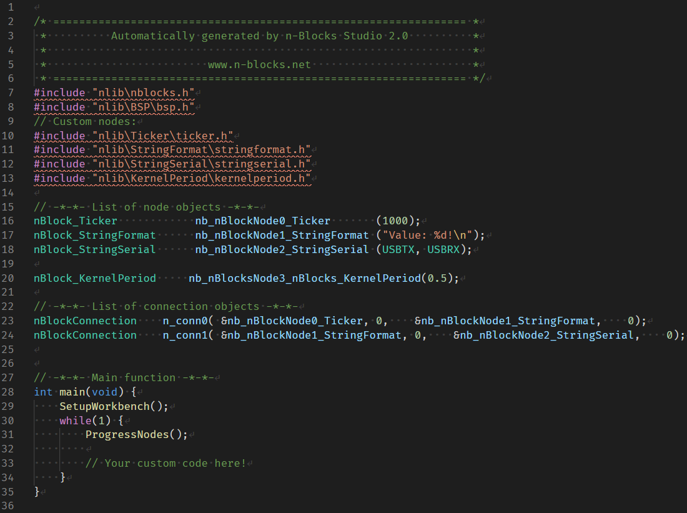
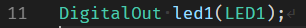
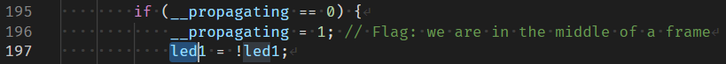
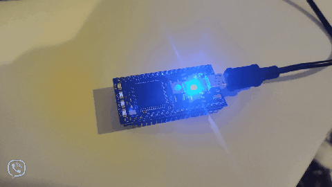
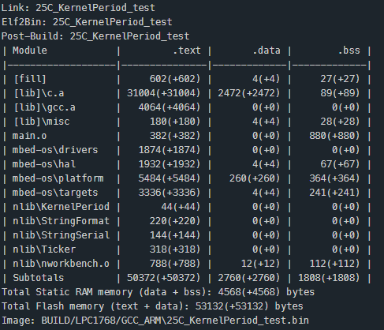
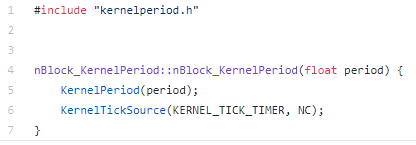

# 25C_KernelPeriod_test
Using the new Node `KernelPeriod', the kernel period can be changed by just modifying the Node parameter.

This nBlocksStudio project sends "Value: 1\n" to the serial port every second. Is a working project to test the new Kernel version `[a14d29e]` [kernel data broadcast, fixed designs without connections](https://github.com/nblocksStudio/nBlocksStudioKernel ).  
Author F.C.

The 'normal' kernel tick period is  0.001 sec. Here the Node `KernelPeriod` set it up to 0.5s and still the kernel outputs all text correctly to the serial port

<!-- pagebreak -->

## Kernel blink Led
 

For this testing and until a new Node KernelBlink is created, the Kernel is modified (only locally in this example directory, in the file workbench.cpp) to toggle an LED in every tick.

## Testing

 * Led blinks at twice the tick period :heavy_check_mark:
 * The string "Value: 1\n" is printed in the serial port :heavy_check_mark:
 * The printing happens every 1000ms :heavy_check_mark:
 * Compiled and Build with mbed-studio os5 bare-metal :heavy_check_mark:

## Node KernelPeriod source code notes

----

----

The first parameter is the source,  can be either `KERNEL_TICK_TIMER` or `KERNEL_TICK_EXT`.

If `KERNEL_TICK_EXT` is used, then the second argument is the pin name for the external clock to be used as tick
